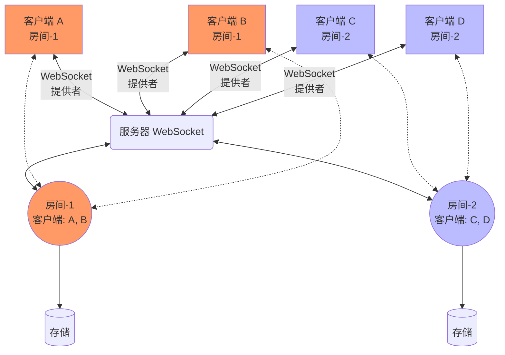

# Ypy-websocket

[English](./README.EN.md)

Ypy-websocket 是一个用于 [Ypy](https://github.com/y-crdt/ypy) 的异步 WebSocket 连接器。

---

**文档**: <a href="https://davidbrochart.github.io/ypy-websocket" target="_blank">https://davidbrochart.github.io/ypy-websocket</a>

**源代码**: <a href="https://github.com/y-crdt/ypy-websocket" target="_blank">https://github.com/y-crdt/ypy-websocket</a>

---

Ypy-websocket 是一个用于构建 WebSocket 服务器和客户端的 Python 库，能够连接并同步共享文档。它可用于创建协作式 Web 应用程序。

以下图表展示了典型的架构。目标是将文档共享给多个客户端。

每个客户端都有一个 [YDoc](https://ypy.readthedocs.io/en/latest/autoapi/y_py/index.html#y_py.YDoc) 实例，代表其对文档的视图。共享文档还在服务器端的 [room](./reference/Room.md) 中存在。从概念上讲，房间可以看作是客户端协作编辑文档的地方。客户端连接的 WebSocket 通过端点路径指向相应的房间。在下面的示例中，客户端 A 和 B 连接到路径为 `room-1` 的 WebSocket，因此这两个客户端都位于名为 `room-1` 的房间中。所有 `YDoc` 的同步逻辑由 [WebsocketProvider](./reference/WebSocket_provider.md) 处理。

对共享文档的每次更新都可以使用 [store](./reference/Store.md) 持久化到磁盘，存储可以是文件或数据库。
